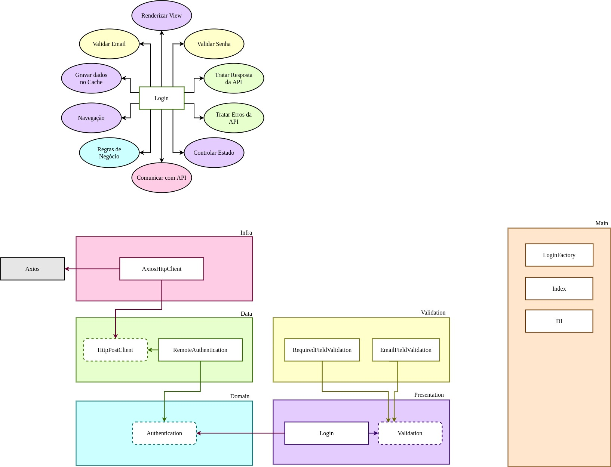

<h1 align="center">Clean React</h1>

## Purpose

An online survey app to solidify and apply advanced knowledge in Design Patterns,
Clean Architecture, SOLID principles & TDD/DDD on projects using React and TypeScript.

## Project Architecture

## Principles

- Single Responsibility Principle (SRP)
- Open Closed Principle (OCP)
- Liskov Substitution Principle (LSP)
- Interface Segregation Principle (ISP)
- Dependency Inversion Principle (DIP)
- Separation of Concerns (SOC)
- Don't Repeat Yourself (DRY)
- You Aren't Gonna Need It (YAGNI)
- Keep It Simple, Silly (KISS)
- Composition Over Inheritance
- Small Commits

## Design Patterns

- Factory
- Adapter
- Composite
- Decorator
- Dependency Injection
- Composition Root
- Builder
- Proxy

## Methodologies & Designs

- TDD
- Clean Architecture
- DDD
- Reactive Programming
- Responsive Layout
- Conventional Commits
- GitFlow
- Modular Design
- Dependency Diagrams
- Use Cases
- Continuous Integration
- Continuous Delivery
- Continuous Deployment

## Libraries & Tools

- Typescript
- React
- Recoil
- React Testing Library
- React Router DOM
- Cypress
- Jest
- Axios
- Git
- Webpack
- SASS + Animations
- NPM
- Travis CI
- Faker
- Coveralls
- Husky
- Lint Staged
- Eslint
- Standard Javascript Style
- React Flip Move
